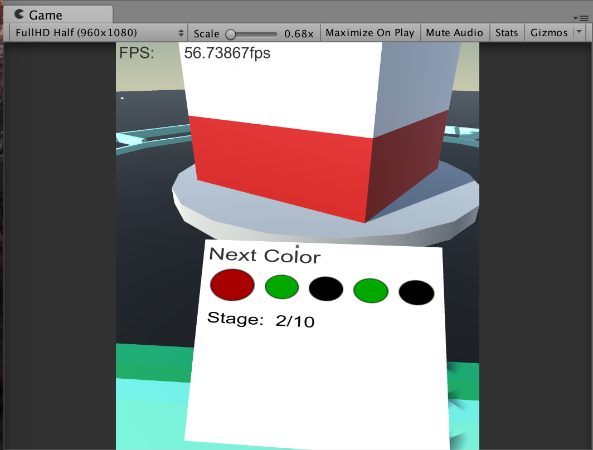

# 進捗報告 17年9月第4週

16cu0125 古山 亮 
16cu0228 米岡 智永

## 進めた作業

  日程 | 曜日 | 古山 | 米岡 
--- | --- | --- | ---
9/17 | 日 | 情報を表示する板? を実装 何色が次に出るかの表示 | 
9/18 | 月 | ステージ数の表示を実装 pcで実行時、カーソルを非表示になるよう変更 |  
9/19 | 火 |  | 効果音の模索 ドーム内のデザインを数案
9/20 | 水 | 今後追加したい機能に使用するコード拡張 | 
9/21 | 木 | この表の制作(体裁など) | 
9/22 | 金 |  | 
9/23 | 土 |  | 

## 画像など
 
▲ 表示板への表示イメージ もう少し表示を工夫したい・・・

## タスクリスト
- ~~進捗表の体裁作成 (古山)~~
- パズル部分の機能 一連の流れを実行できるように (古山)
- スカイドームの作成 (米岡)
- 生成される建物オブジェクトのバリエーション増加 (米岡)
- パズル問題の作成